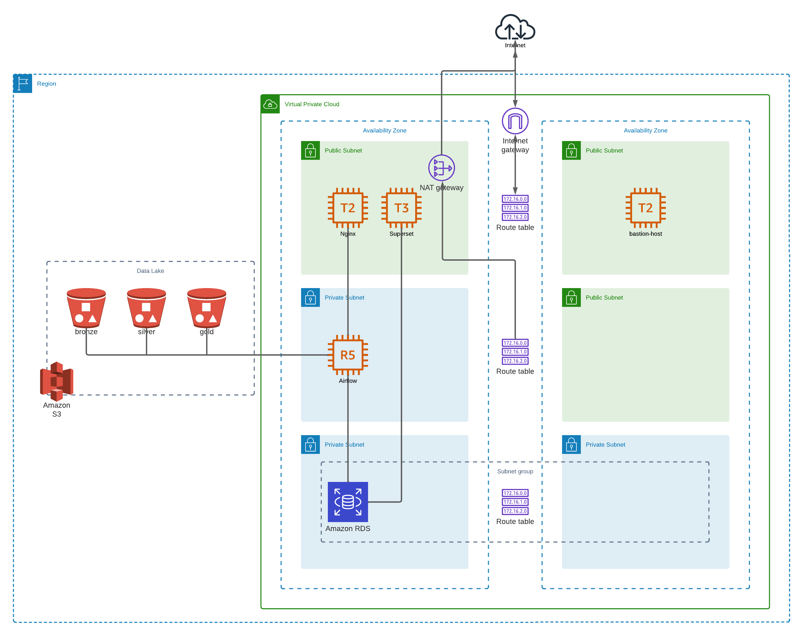

# airflow-ml

## Resumen

Se desarrolló un data pipeline utilizando Airflow, que extrae datos raw (bronze bucket) del Data Lake implementado en S3, realiza el cleaning de los datos y ajustes de esquema almacenando el resultado en el silver bucket y finalmente realiza una agregación simple de los datos almacenando el resultado en el bucker gold.
Se utilizó para este desarrollo el dataset de Kaggle de demoras y cancelaciones de vuelos en USA entre 2009 y 2018: Airline Delay and Cancellation Data, 2009 - 2018 ( https://www.kaggle.com/datasets/yuanyuwendymu/airline-delay-and-cancellation-data-2009-2018 )

## Diagrama de infraestructura

  
 

