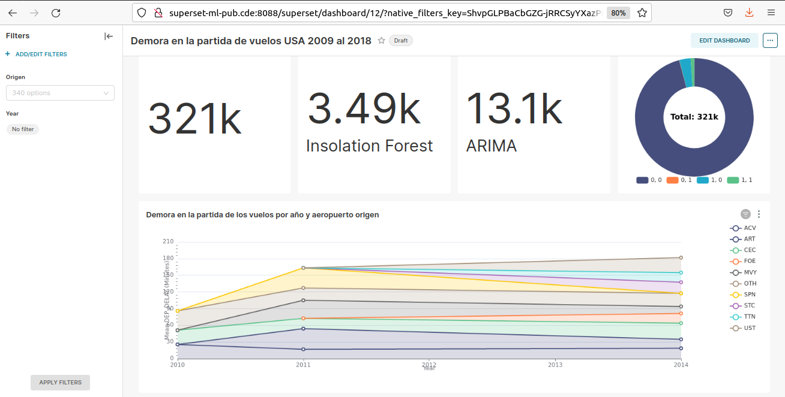

# Data Pipeline con Machine Learning usando Airflow sobre EC2 y RDS Postgres  

## Resumen

Se desarrolló un data pipeline en Airflow que extrae datos crudos de la ubicación *bronze* del Data Lake implementado en S3, realiza el cleaning y ajustes de esquema almacenando el resultado en la ubicación *silver* y finalmente realiza sobre los mismos algún tipo de agregación almacenando el resultado en el ubicación *gold* del Lake.
Se utilizó para este desarrollo el dataset de Kaggle de demoras y cancelaciones de vuelos en USA entre 2009 y 2018 [Airline Delay and Cancellation Data, 2009 - 2018]( https://www.kaggle.com/datasets/yuanyuwendymu/airline-delay-and-cancellation-data-2009-2018 )

## Diagrama de infraestructura

  
 

## Descripción de infraestructura

A continuación se describen los recursos creados en AWS para soportar la aplicación.

## Data Lake

Se creo el bucket S3 **airflow-ml-datalake** - se utilizar cualquier otro nombre que este disponible. Luego se indica el mismo en las variables que utiliza Airflow - y dentro del mismo las siguientes carpetas:

- /01_bronze
- /02_silver/year
- /03_gold/agg_dep_delay_by_date/year

## Network

Se creó una VPC con CIDR 10.0.0.0/16 que incluye 2 zonas de disponibilidad para implementar alta disponibilidad en el futuro. Sobre la VPC se desplegaron los siguientes recursos:

- Internet Gateway

**Capa Pública**

2 Subnets públicas:
- public-subnet-1: 10.0.1.0/24
- public-subnet-2: 10.0.2.0/24

Tabla de rutas pública:
- public-rt

La tabla de rutas se asoció a ambas subnets públicas e incorporan la ruta de salida a internet a travez del Internet Gateway

0.0.0.0/0   Internet_Gateway_ID

Se crea también un NAT Gateway que se ubica en cualquier de las subnets públicas. Este gateway será utilizado por la capa de aplicación.

**Capa de Aplicación**

2 Subnets privadas con salida a internet - vía NAT Gataway -:
- private-subnet-1: 10.0.3.0/24
- private-subnet-1: 10.0.4.0/24

Tabla de rutas pública:
- private-rt

La tabla de rutas `private-rt` se debe asociar a las 2 subnets privadas y debe incorporar una ruta de salida a internet vía NAT Gateway

0.0.0.0/0   NAT_Gataway_ID

Se incorpora este recurso para permitir el download de las imágenes docker necesarias para el deploy de Airflow sobre la EC2.

**Capa de Base de Datos**

2 Subnets privadas sin salida a internet:

- private-subnet-3: 10.0.5.0/24
- private-subnet-4: 10.0.6.0/24

RDS subnet group:
- `vpc-airflow-ml-subnets-group` que incluya las 2 subnets anteriores. 

Estas 2 subnets heredan la asignación de la tabla de rutas default de la VPC y no hace falta cambiarla.

## Compute

Se crearon las siguientes instancias EC2 con Ubuntu 22.04 en las capas que se indican. La subnet elegida en cada capa es indistinta.

En capa pública:

- `bastion-host`: Instancia EC2 tipo *t2.micro* que se utiliza como punto de acceso público por ssh a la infraestructura privada asi como también a la RDS.
- `nginx`: Instancia EC2 tipo *t2.micro* que se uliza como proxy reverso para acceder al webserver de Airflow en la capa de aplicación. Los comandos para instalat Nginx en Ubuntu son los siguientes

        $> sudo apt update
        $> sudo apt install nginx

editar el sitio default en `/etc/nginx/sites-enabled` para que quede como sigue:

    server {
        listen 80;
        
        server_name airflow-ml.cde;

        location / {
                proxy_pass http://10.0.3.75:8080;
                proxy_set_header Host $http_host;
                #proxy_redirect off;
                proxy_http_version 1.1;
                proxy_set_header Upgrade $http_upgrade;
                proxy_set_header Connection "upgrade";
    }
    }

La ip `10.0.3.75` es en este caso la ip privada que le fué asignada a la instancia de Airflow. Reemplazar este dato con el valor que corresponde.

Una vez configurado el servidor Nginx, realizar el restart del servicio

    $> sudo systemctl restart nginx.service

- `superset-pub`: Instancia tipo *t3.large* que se utiliza para servir los dashboards de análisis.
Para el deploy de esta aplicación se instaló [Docker](https://docs.docker.com/engine/install/ubuntu/) sobre la instancia y desde `/home/ubuntu` se corrieron los comandos que siguen:

        $> mkdir superset
        $> cd superset
        $> git clone https://github.com/apache/incubator-superset/
        $> cd incubator-superset
        $> docker-compose -f docker-compose-non-dev.yml up -d

En capa de aplicación:

- `airflow`: Instancia tipo *r5.large* (memory-optimized) para correr Airflow sobre Docker. Al igual que el caso anterior, se instaló Docker y sobre el directorio `/home/ubuntu` se clonó el repositorio del proyecto

        $> git clone git@github.com:jdanussi/airflow-ml.git
        $> cd airflow-ml

        # Configuramos los derechos del usuario Airflow
        $> echo -e "AIRFLOW_UID=$(id -u)" > .env
        
        # Inicializamos la base de datos
        $> docker compose up airflow-init

        # Corremos airflow
        $> docker-compose up -d

Sobre el archivo `docker-compose.yaml` oficial se realizaron los siguientes cambios:

Se agregó la librería `scikit-learn` necesaria para las tareas de Machine Learning

    _PIP_ADDITIONAL_REQUIREMENTS: ${_PIP_ADDITIONAL_REQUIREMENTS:-scikit-learn apache-airflow[amazon]}

Se agregó el volumen `data` para procesar localmente los datos

    volumes:
        ...
        - ./data:/opt/airflow/data

y en la sección de `airflow-init`

        mkdir -p /sources/logs /sources/dags /sources/plugins /sources/data
        chown -R "${AIRFLOW_UID}:0" /sources/{logs,dags,plugins,data}

- `database-ml`: RDS de tipo *db.t3.micro* con base de datos inicial `ml_resuls`. Si la base no se crea inicialmente con la RDS, se puede crear luego.

## Elastic IP

Alocar 4 IP públicas elásticas y asignarla a los siguientes recursos:

- `vpc-airflow-ml-ngw` (NAT Gateway de la capa de aplicación)
- `bastion-host` 
- `nginx`
- `superset-pub`

Estas EIPs facilitan la gestión del ambiente de laboratorio que cambia con cada sesión.

## Seguridad

Los grupos de seguridad de cada recurso deben ser configurados con los accesos mínimos requeridos (buena práctica!). 

Para ello se establecen las reglas inbound de los security groups según se indica a continuación:

Reglas Inbound de los Security Groups:

- `bastion-host-sg`: 
    - Se permite acceso ssh desde cualquier origen 0.0.0.0/0.

- `superset-pub-sg`: 
    - Se permite acceso ssh solo desde `bastion-host`.
    - Se permite acceso a puerto 8088 desde cualquier origen 0.0.0.0/0.

- `nginx-sg`:
    - Se permite acceso ssh solo desde `bastion-host`.
    - Se permite acceso a puerto HTTP desde cualquier origen 0.0.0.0/0.

- `airflow-sg`:
    - Se permite acceso ssh solo desde `bastion-host`.
    - Se permite acceso a puerto 8080 solo desde `nginx`.

- `database-ml-sg`:
    - Se permite a Postgres a `bastion-host`.
    - Se permite a Postgres a `airflow`.
    - Se permite a Postgres a `superset-pub`.
  

## Flujo ETL y Machine Learning

El flujo de ETL se realiza desde la instancia EC2 `airflow` que corre Airflow 2.4.2 sobre un contenedor de Docker. 

Como se corre Airflow sobre una EC2 en forma standalone y no sobre un cluster, se decidió usar el *Local Executor* con *PostgresSQL* como backend porque esta configuración permite la ejecución simultánea de tareas. Aunque para este caso no es necesario la simultaneidad, se seteó así para probar.
En contraste, también puede configurarse un *Sequential Executor* con *SQLite* como backend - no es posible correr tareas simultáneas por limitaciones de SQLite - o *Celery Executor* que permite el escalado de los workers dentro de un cluster.

El DAG `etl_ml_pipeline con` se ejecuta anualmente, cada 01/Ene a la 00:00 hs y realiza en secuencia lo siguiente:

1. Desde la ubicación *bronze* de S3 se descarga el archivo {lastyear}.csv que corresponde al año anterior, se renombra a {lastyear_01_bronze.csv}.

2. Con el archivo ubicado en la EC2 se realiza tareas de cleaning y ajuste de esquema - se eliminan las filas con datos nulos en la columna DEP_DELAY, se renombran columnas, etc -. Una vez finalizada la limpieza y transformación, se realiza un upload del dataset refinado en formato *parquet* a la ubicación **silver** del Data Lake 

    `/02_silver/year/{lastyear}/{lastyear}_02_silver.parquet`

    Los datasets ahi almacedos pueden ser útiles para posteriores análisis de datos.

3. Con el dataset refinado - que aun sigue almacedado localmente en la instacia donde corre Airflow - se realiza una agregación de los datos promediando el tiempo de demora de la partida de los vuelos por Año y por Origen. 
Se realiza un upload del dataset con información agregada en formato parquet a la ubicación **gold** del Data Lake 

    `airflow-ml-datalake/03_gold/agg_dep_delay_by_date/year/{lastyear}/{lastyear}_03_gold.parquet`

    Los datasets ahi almacedos pueden ser útiles para presentar en dashboards de análisis.

4. El dataset con información agregada ingresa en un proceso de Machine Learning para detectar anomalías en el promedio de las demoras. 
Para la detección de anomalías en series temporales se utilizó el modelo no supervisado *Insolation Forest* que suele ser efectivo cuando el hiperparámetro de *contaminación* - porcenje de outliers respecto a los datos totales - es bajo, típicamente un 10% o 0.01. Pueden consultarse los análisis realizados con el modelo en los notebooks ubicados en la carpeta `/notebooks`. 

5. Las anomalías encontradas por el modelo son señaladas dentro del dataset, y los datos con esta información adicional se almacenan en una RDS Postgres que sirve como soporte del Data Warehouse.

6. Finalmente, la última tarea del DAG es eliminar todos los archivos descargados y generdos durante la corrida. 

  
 

## UPSERTs de base de datos

Se modificó la clase `dags/utils/db_handler.py` que se utilizó en entregas anteriores para que permita el UPSERTs de registros en tablas (INSERT si el registro no existe o UPDATE si existe).

Para poder utilizar este método es importante tener control de la Primary Key de la tabla con la que se trabaja. En nuestro caso fué posible utilizando como PK un *id* generado a partir de la concatenación del código de aeropuerto - `origin` - y de la fecha de partida - `fl_date` - . Ej:  Aeropuerto JFK con fecha de partida 2009-01-01 -> id = JFK20090101.

A continuación se muestra la función implementada para UPSERT:

    def insert_from_frame(self, df, table, if_exists="append", index=False, **kwargs):
        """Docstring."""
        connection = self._connect()
        with connection:
            df = df.set_index('id')

            # dump a slice with changed rows to temporary MySQL table
            df.to_sql('tmp_table', connection, if_exists='replace', index=True)

            trans = connection.begin()

            try:
                # delete those rows that we are going to "upsert"
                connection.execute(f'delete from {table} where id in (select id from tmp_table)')
                trans.commit()

                # insert changed rows
                df.to_sql(table, connection, if_exists=if_exists, index=True)
            except:
                trans.rollback()
                raise

## Dashboard de Analísis

La instancia EC2 `superset-pub` corre Apache Superset sobre un contenedor de Docker, utilizando Postgres como backend.

Superset está conectado a la RDS que almacena los datos procesados por el pipeline ML. Sobre el mismo se creo un dashboard que muestra algunos datos sobre demoras y las anomalías. 

Se intentó desplegar Apache Superset en la capa de aplicación detrás de Nginx pero no resultó bien porque se generaban errores de timeout en Nginx al tratar de cargar los schemas de la RDS desde el SQL Lab de Superset. 

A continuación se muestran algunas capturas del dasboard:

 

 

## Cuestiones para mejorar

- Utilizar más modelos de Machile Learning y compararlos para utilizar en el pipeline el que sea más eficiente para detectar las anomalías.
- Implementar SSL en Nginx, en el webserver de Airflow y en Superset, para evitar transmitir credenciales sin encriptar.
- Resolver el problema de Nginx haciendo de proxy a Superset. La aplicación de analítica no tiene porque estar expuesta directamente a internet.
- 
